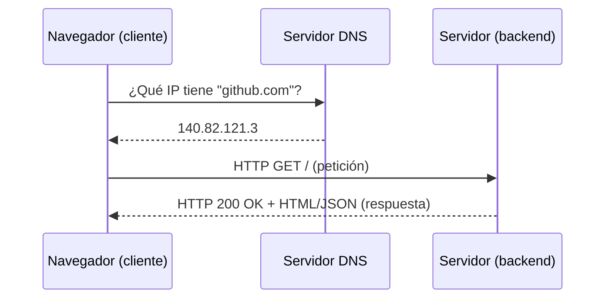
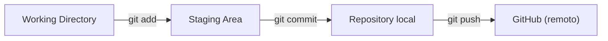
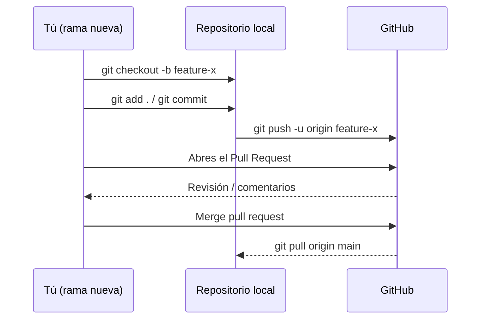

# 00-fundamentos / git-y-terminal

Cómo funciona la web, la terminal y Git — la base operativa para todo lo que viene después. Este README resume la teoría vista y sirve como referencia rápida; tus ejercicios resueltos van en esta misma carpeta.

## Progreso

- [x] Cómo funciona la web: HTTP, cliente-servidor, DNS
- [x] Terminal básica: navegación, archivos, permisos
- [x] Git: init, add, commit, branch, merge, push, pull
- [x] Flujo de Pull Request en GitHub

---

## 1. Cómo funciona la web

**El ciclo cliente-servidor:**

**Anatomía de una petición HTTP:**
- **Verbo** (`GET`, `POST`, `PUT`, `DELETE`) → qué acción se pide
- **Ruta** (`/usuarios/42`) → qué recurso se pide
- **Código de estado** (`2xx` éxito, `4xx` error del cliente, `5xx` error del servidor)
- **Cuerpo** (`body`) → los datos que viajan

**Idea clave:** cada recurso independiente que la página necesita (HTML, CSS, JS, imágenes, llamadas a una API) genera su propia petición — por eso una sola página dispara decenas de filas en la pestaña Network de las DevTools.

---

## 2. Terminal básica

| Comando | Qué hace |
|---|---|
| `pwd` | Muestra la carpeta actual |
| `ls` | Lista el contenido de la carpeta |
| `cd carpeta` | Cambia de carpeta |
| `cd ..` | Sube a la carpeta padre |
| `cd .` | Se queda en la carpeta actual (no mueve nada) |
| `mkdir nombre` | Crea una carpeta |
| `touch archivo` | Crea un archivo vacío |
| `rm archivo` | Elimina un archivo (sin papelera) |
| `rm -r carpeta` | Elimina una carpeta completa con su contenido |

**Rutas:**
- **Absoluta**: parte desde la raíz del disco (`/c/dev/ruta-fullstack`)
- **Relativa**: parte desde donde estás parado ahora (`cd ruta-fullstack`)

---

## 3. Git — control de versiones

**Los tres estados de un archivo:**

| Comando | Qué hace |
|---|---|
| `git init` | Convierte la carpeta actual en un repositorio |
| `git status` | Muestra qué cambió y en qué estado está |
| `git add .` | Mueve todos los cambios a staging |
| `git commit -m "mensaje"` | Guarda una nueva versión permanente |
| `git log` | Muestra el historial de commits |
| `git remote add origin <url>` | Conecta el repo local con uno en GitHub |
| `git push` | Sube los commits al remoto |
| `git pull` | Trae cambios del remoto |

**Por qué `add` y `commit` son dos pasos separados:** te permite elegir exactamente qué cambios entran en cada "foto" del historial, en vez de subir todo lo modificado sin control.

---

## 4. Flujo de Pull Request en GitHub

| Comando | Qué hace |
|---|---|
| `git branch` | Lista las ramas existentes |
| `git checkout -b nombre` | Crea una rama nueva y te mueve a ella |
| `git checkout main` | Vuelve a la rama principal |
| `git push -u origin nombre` | Sube una rama nueva a GitHub por primera vez |

**Por qué no se trabaja directo en `main`:** una rama aparte deja experimentar y equivocarse sin romper la versión que ya funciona. El PR es el paso donde el cambio se revisa antes de integrarse.

---

## Mis notas / ejercicios resueltos

*(agrega aquí tus propias observaciones, capturas o dudas a medida que repites los ejercicios)*

-
